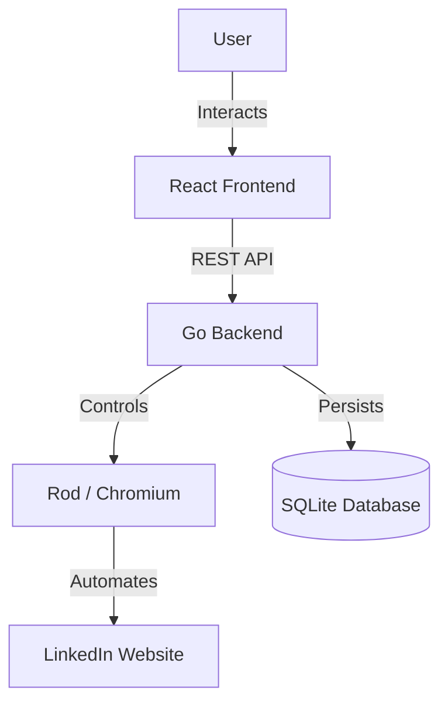

# High Level Design (HLD)

## System Overview
The Browser Automation System is a hybrid desktop/web solution designed to automate LinkedIn interactions (Login, Search, Connect, Message) while simulating human behavior to avoid detection. It consists of a Go backend (controlling a headless Chromium browser) and a React frontend (dashboard for control and monitoring).

## Architecture Diagram

## Components
1.  **Frontend (UI)**:
    *   **Tech**: React, Tailwind CSS, Vite.
    *   **Role**: Provides a user interface to start/stop automation, view real-time logs, and see historical activity data.
    *   **Communication**: Polls Backend API for status and data.

2.  **Backend (Controller)**:
    *   **Tech**: Go (Golang), Rod (Browser Automation), GORM (ORM).
    *   **Role**:
        *   **API Layer**: Exposes endpoints (`/start`, `/stop`, `/data`).
        *   **Automation Layer**: Manages browser lifecycle, executes automation tasks, implements stealth logic (random delays, mouse movements).
        *   **Data Layer**: Stores profile data and activity logs.

3.  **Storage**:
    *   **Tech**: SQLite.
    *   **Role**: Local persistence of actions to track history and prevent duplicate actions.

## Data Flow
1.  **Start Command**: User clicks "Start" -> UI calls `POST /api/start`.
2.  **Automation Loop**: Backend initializes Browser -> Logs in -> Searches Profiles -> Sends Requests -> Saves to DB.
3.  **Monitoring**: UI calls `GET /api/status` (polling) -> Backend returns logs/running state -> UI updates.
4.  **History**: UI calls `GET /api/data` -> Backend queries SQLite -> UI renders table.
